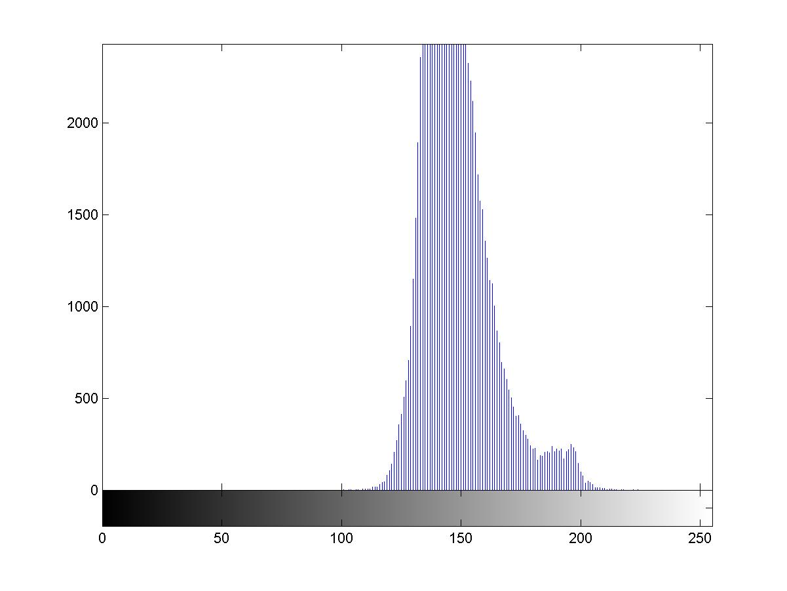
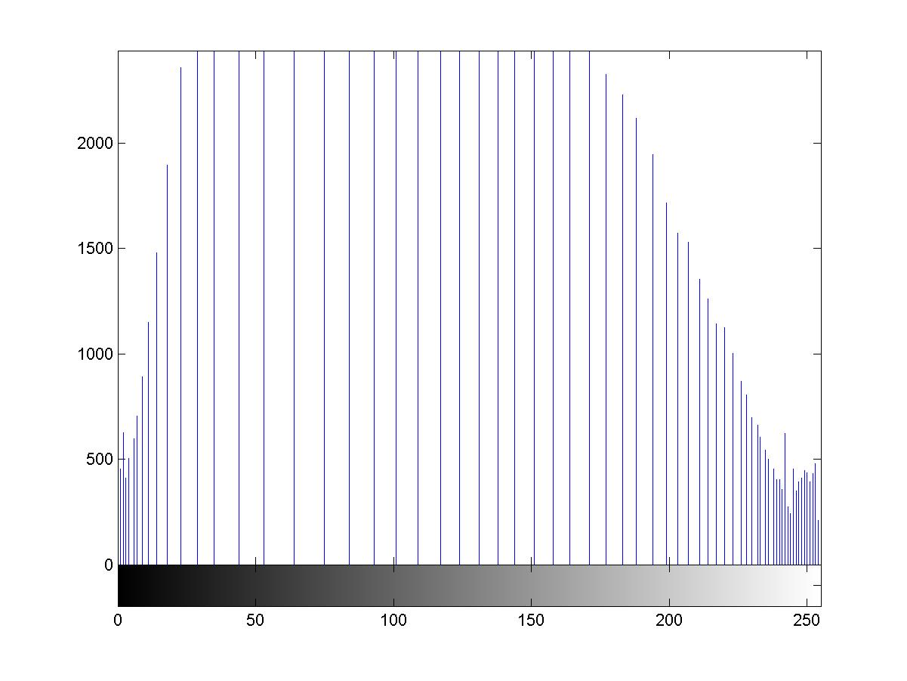
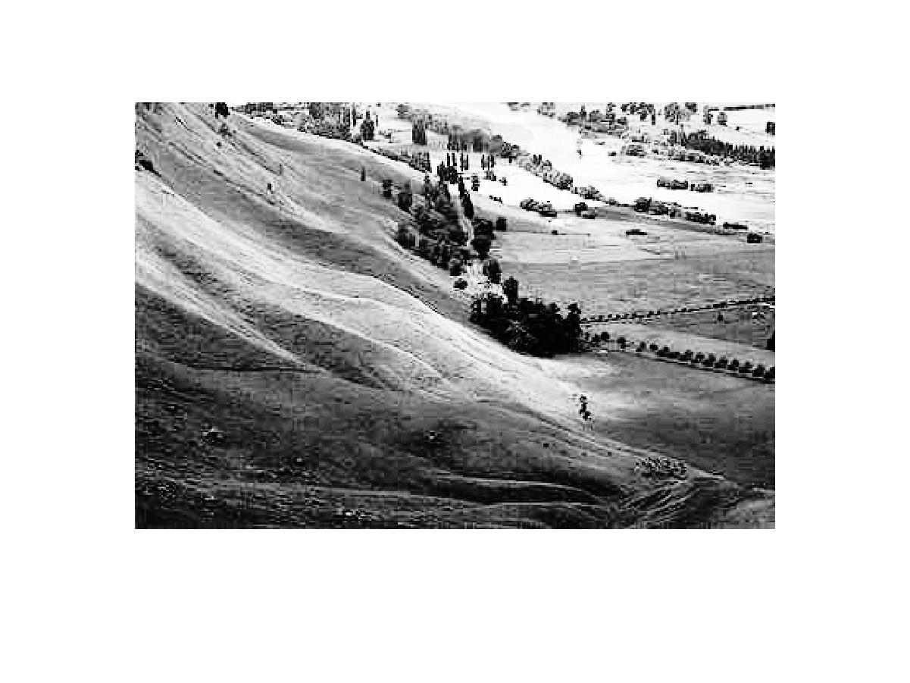

在处理图像时，偶尔会碰到图像的灰度级别集中在某个小范围内的问题，这时候图像很难看清楚。比如下图。

它的灰度级别，我们利用一个直方图可以看出来（横坐标从0到255，表示灰度级别，纵坐标表示每个灰度级别的像素出现个数）

可以看出，上图是由于灰度级过于集中，导致图片难以看清。

这时候我们可以把灰度级别“拉开”，使得灰度级多且分布均匀，让图片具有高对比度和多变的灰度色调。

 

那么如何拉开才能使得灰度级别占据从0到255的整一个范围呢？

我们可以先利用概率，计算出原图中每一个灰度级别的像素个数占所有像素个数的比例，然后比例逐个灰度级别地累加，接着把累加比例乘以256，得出该灰度级别“拉开”之后应该在哪一个级别。

举一个例子，假设一张图片像素点对应的矩阵为

f=[100,100,100,100,100;
110,110,110,110,110;
120,120,120,120,120;
130,130,130,130,130;
140,140,140,140,140];

那么我们可以看到灰度级别为100的像素个数的比例为1/5，那么现在灰度级别应该改为round(1/5*256-1)。之所以-1是因为灰度级从0到255，取整是因为灰度级均为整数。

接下来110所占比例也是1/5，累加比例变成2/5，所以灰度级别应该是round(2/5*256-1)。

120对应的累加比例为3/5，就应该是round(3/5*256-1)

……

如此，就可以把灰度级拉开。拉开后直方图如下.

最后效果如下
